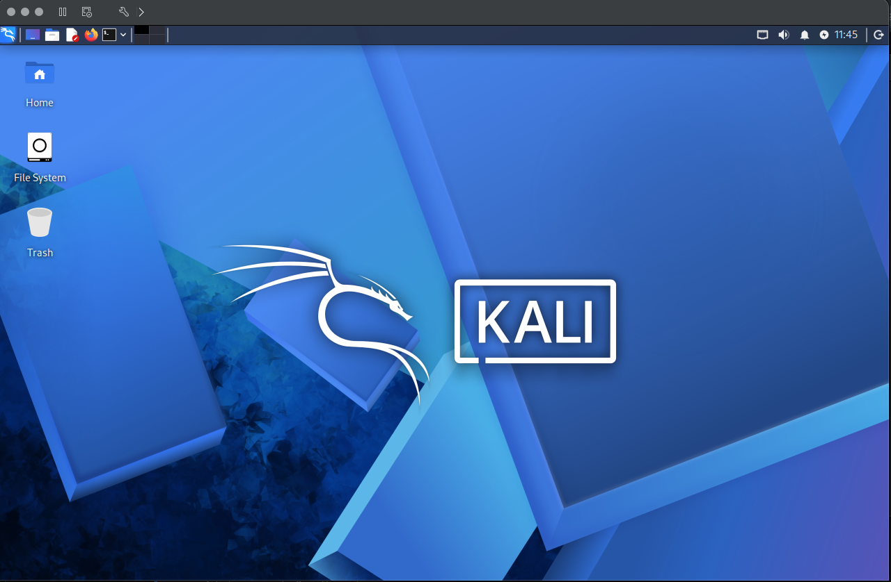

# Hands-On Assignment #1: Penetration Testing Lab Setup

## Student: [Your Name]
## Course: [Course Name]
## Date: [Submission Date]

---

# 1. Overview

This project involved setting up a local penetration testing lab environment using virtualization technology. The goal was to simulate a real-world security testing environment consisting of an attacker machine (Kali Linux) and a vulnerable target machine (Metasploitable 2 / alternative VM).

The lab was used to practice network scanning, vulnerability assessment, and penetration testing concepts.

---

# 2. Technology Stack

| Component | Details |
|----------|--------|
| Host Machine | MacBook Pro (2017 Intel) |
| Virtualization Software | VMware Fusion |
| Attacker VM | Kali Linux |
| Target VM | Metasploitable 2 (Vulnerable Linux VM) |
| Security Tool | Nessus Essentials |
| Network Mode | NAT / Host-Only Networking |

---

# 3. Lab Architecture

The lab consists of two virtual machines:

- Kali Linux → Attacker machine used for scanning and penetration testing
- Metasploitable 2 → Vulnerable target machine

Both VMs are connected through a virtual network allowing communication between them.

### Architecture Diagram

---

# 4. Virtualization Environment Setup

The virtualization environment was created using VMware Fusion. Two virtual machines were configured and managed from the same interface.

### Screenshot: VMware Running with VMs

---

# 5. Kali Linux Setup

Kali Linux was installed and configured as the primary penetration testing machine. It was used to run network discovery, ping tests, and vulnerability scanning using Nessus.

### Screenshot: Kali Linux Desktop

---

# 6. Target Machine Setup (Metasploitable 2)

Metasploitable 2 was initially selected as the target vulnerable system. However, during setup, compatibility issues were encountered on Apple Silicon hardware (Mac Mini M4).

The VM failed to boot properly and repeatedly showed boot manager / no operating system found errors due to architecture mismatch (ARM vs x86).

To resolve this, the setup was moved to an Intel-based system (MacBook Pro 2017), where Metasploitable 2 ran successfully.

### Screenshot: Target VM Running

---

# 7. Networking Configuration

Both virtual machines were configured to use the same virtual network to allow communication between attacker and target systems.

Verification was done using IP address checks and ping tests.

### Screenshot: IP Address (Kali)

### Screenshot: Ping Test from Kali to Target

---

# 8. Nessus Installation and Setup

Nessus Essentials was installed on Kali Linux for vulnerability scanning. After installation, the service was accessed via:

https://localhost:8834

Initial plugin download issues were encountered but resolved by restarting the Nessus service and ensuring proper network connectivity.

### Screenshot: Nessus Setup Page

---

# 9. Problems Encountered and Solutions

## Issue 1: Metasploitable Not Booting (Mac Mini M4)

- Problem: VM showed “Boot Manager” and “No operating system found”
- Cause: Apple Silicon (ARM64) incompatibility with x86 Metasploitable VM
- Solution: Switched to Intel-based MacBook Pro (2017), where VM booted successfully

---

## Issue 2: CD/DVD and Boot Errors in VMware

- Problem: VM initially showed “sata0:1 device not available”
- Cause: Misconfigured virtual CD/DVD drive
- Solution: Removed CD/DVD device from VM settings

---

## Issue 3: Nessus Plugin Download Failure

- Problem: Nessus showed “download failed”
- Cause: Temporary network or initialization issue
- Solution: Restarted Nessus service and reloaded UI

---

## Issue 4: Network Connectivity Issues

- Problem: Ping between machines initially failed
- Cause: Incorrect network adapter configuration
- Solution: Ensured both VMs were on same NAT/Host-Only network

---

# 10. Conclusion

This lab successfully demonstrated the setup of a basic penetration testing environment using virtualization tools. It provided hands-on experience with system configuration, network troubleshooting, and vulnerability scanning.

Despite initial hardware compatibility challenges on Apple Silicon, the environment was successfully deployed on an Intel-based Mac system, allowing full completion of the assignment objectives.

---

# 11. References

- Kali Linux Official Documentation
- Metasploitable 2 Project
- Nessus Essentials by Tenable
- VMware Fusion Documentation